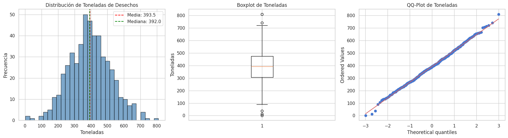
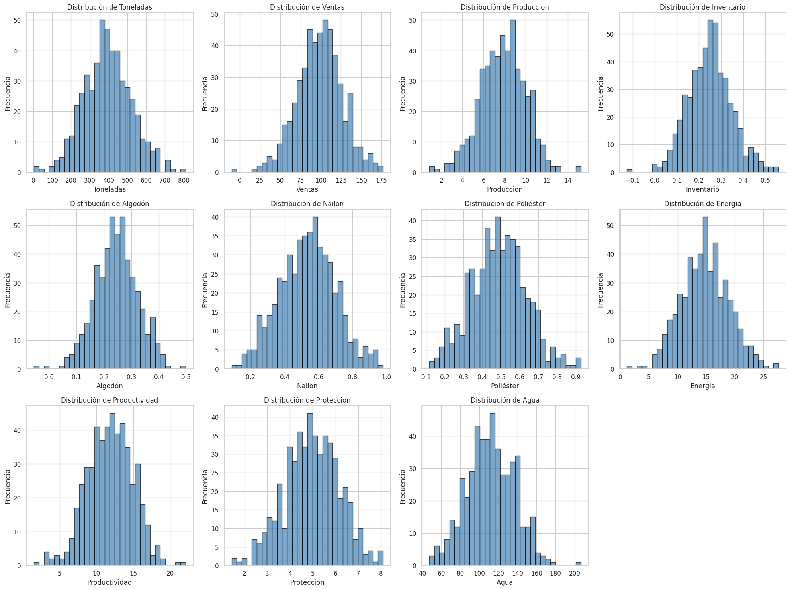
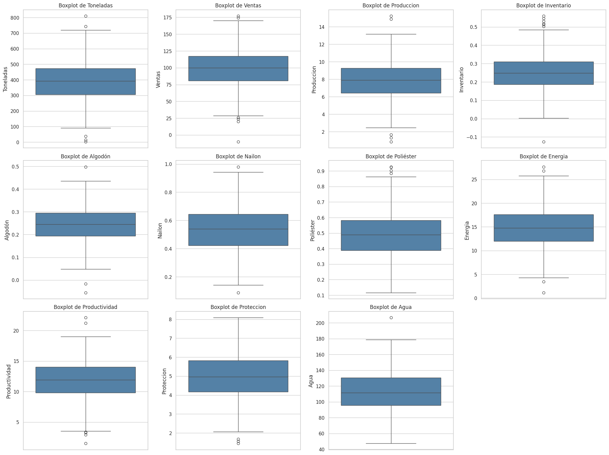
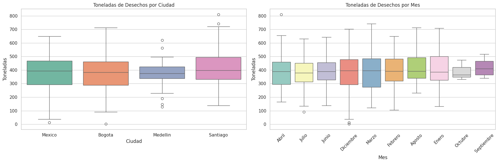
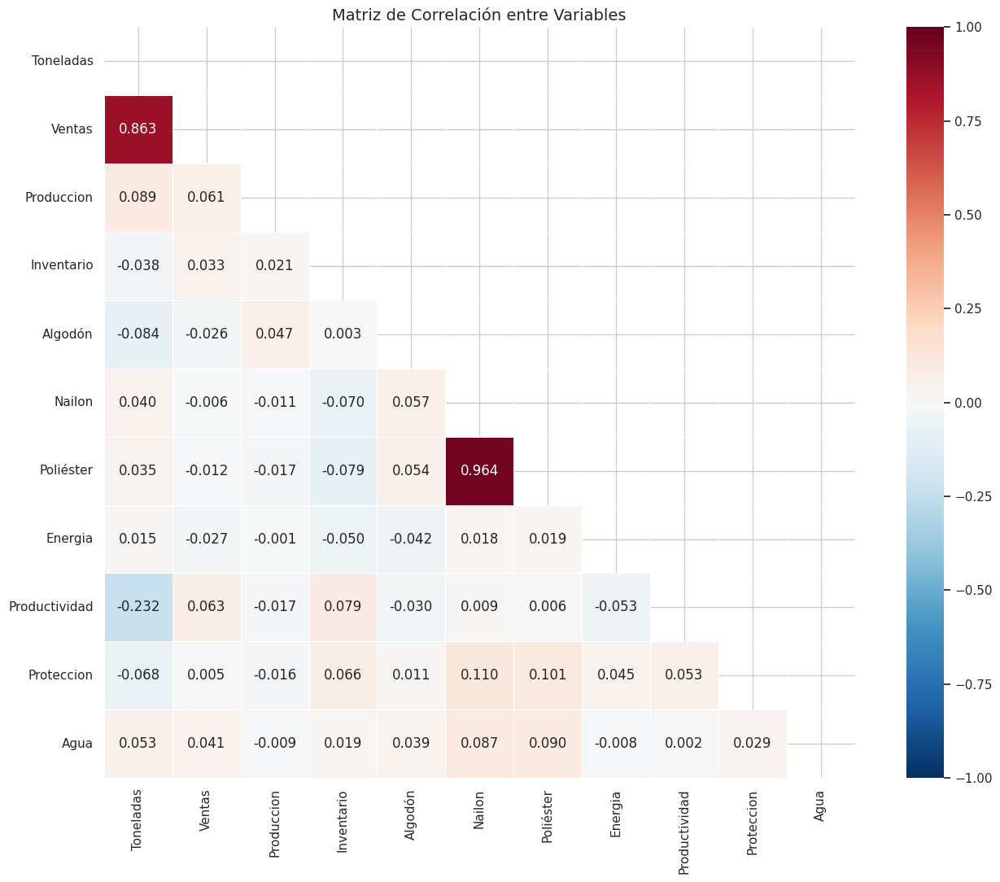
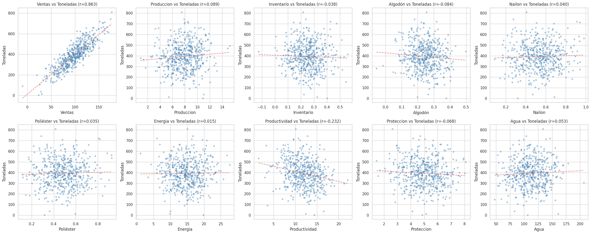
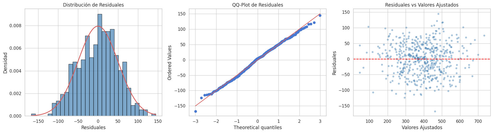
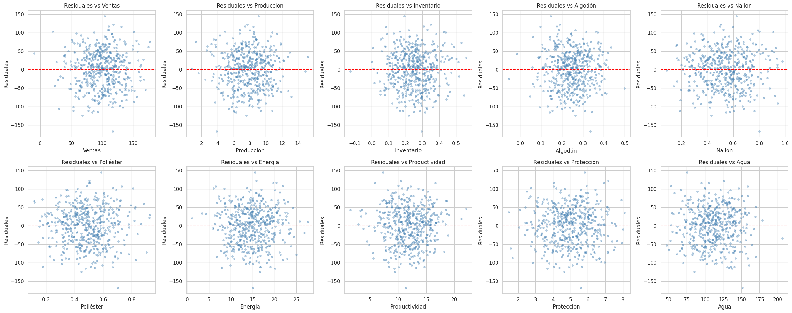

# Taller 1 — Toma de Decisiones II (2026-01)
# Análisis de Desechos Textiles en Latinoamérica

**Programa de Ingeniería Industrial**
**Consultora de Sostenibilidad — Industria Textil**

---

## Introducción y Contexto del Problema

La industria textil opera bajo un modelo de producción lineal ("extraer-producir-consumir-desechar") que genera un impacto ambiental considerable. Una de las problemáticas más grandes es la generación de desechos textiles, cuya cuantificación resulta compleja dada la extensión de la cadena de suministro.

En este contexto, una consultora que asesora marcas textiles en Latinoamérica nos ha contratado para analizar estadísticamente qué factores influyen en la cantidad de desechos textiles generados mensualmente en distintas ciudades. El objetivo final es diseñar estrategias basadas en evidencia que permitan a las marcas reducir sus desechos.

Para ello se recolectaron 500 observaciones mensuales de desechos textiles (en toneladas) junto con 12 variables explicativas que describen las métricas de producción, materias primas, indicadores energéticos y ambientales de las marcas más relevantes de cada ciudad.

### ¿Por qué un modelo de regresión lineal múltiple?

Porque necesitamos entender la relación simultánea entre múltiples variables independientes (ventas, materias primas, energía, etc.) y una variable dependiente continua (toneladas de desechos). La regresión lineal múltiple nos permite:
- Cuantificar el efecto individual de cada variable controlando por las demás.
- Identificar qué variables son estadísticamente significativas.
- Hacer predicciones y proponer escenarios de optimización.
- Realizar contrastes de hipótesis sobre combinaciones lineales de coeficientes.

### Descripción de las Variables

| Variable | Tipo | Descripción | Unidad |
|----------|------|-------------|--------|
| Toneladas | Dependiente (Y) | Desechos textiles mensuales generados en la ciudad | Toneladas |
| Ventas | Continua | Ventas mensuales promedio | Miles de USD |
| Producción | Continua | Costos promedio de producción mensuales | Miles de USD |
| Inventario | Continua | Porcentaje de producción destinado a inventario | Proporción (0-1) |
| Algodón | Continua | Porcentaje de materia prima que es algodón orgánico | Proporción (0-1) |
| Nailon | Continua | Porcentaje de materia prima que es fibra de nailon | Proporción (0-1) |
| Poliéster | Continua | Porcentaje de materia prima que es fibra de poliéster | Proporción (0-1) |
| Energía | Continua | Consumo mensual promedio de productos energéticos | Miles de terajulios |
| Productividad | Continua | Ventas promedio / consumo de energía | USD / kWh |
| Protección | Continua | Inversión mensual en protección al medio ambiente | Unidades monetarias |
| Agua | Continua | Gasto promedio mensual de agua en producción | Miles de m³ |
| Ciudad | Categórica | Ciudad latinoamericana donde se midieron los desechos | Bogotá, Medellín, México, Santiago |
| Mes | Categórica | Mes del año en que se midieron los desechos | 10 meses registrados |

---

## Punto 1: Análisis Descriptivo (10/100)

### ¿Qué se hizo?
Se realizó una exploración completa del dataset mediante estadísticas descriptivas (media, mediana, desviación estándar, coeficiente de variación, asimetría, curtosis) y visualizaciones (histogramas, boxplots, QQ-plots, matriz de correlación, gráficos de dispersión).

### ¿Por qué se hizo?
Antes de construir cualquier modelo, es fundamental entender la naturaleza de los datos. El análisis descriptivo permite:
- Detectar valores nulos, atípicos o errores en los datos.
- Entender la distribución de cada variable (¿es simétrica? ¿tiene outliers?).
- Identificar relaciones preliminares entre variables (correlaciones).
- Verificar si la variable dependiente tiene una distribución razonable para modelar.
- Detectar posibles problemas como multicolinealidad desde el inicio.

### ¿Qué se encontró?

**Sobre el dataset:**
- 500 filas, 13 columnas, cero valores nulos. El dataset está completo y limpio.
- Santiago concentra el 40% de las observaciones (200), mientras que Medellín solo tiene 44. Esta distribución desbalanceada es importante tenerla en cuenta al interpretar resultados por ciudad.
- Los meses no están uniformemente distribuidos: Abril tiene 113 registros, pero Octubre solo 3 y Septiembre 4. Esto limita la confiabilidad de las estimaciones para esos meses.

**Sobre la variable dependiente (Toneladas):**

| Estadístico | Valor | Interpretación |
|-------------|-------|----------------|
| Media | 393.46 | En promedio se generan ~393 toneladas de desechos mensuales |
| Mediana | 391.98 | Muy cercana a la media → distribución simétrica |
| Desv. Estándar | 126.12 | Variabilidad considerable entre observaciones |
| CV% | 32.05% | Variabilidad moderada-alta respecto a la media |
| Asimetría | 0.076 | ≈ 0 → distribución simétrica (no sesgada) |
| Curtosis | 0.105 | ≈ 0 → mesocúrtica (colas similares a la normal) |
| Mínimo | 2.17 | Existe al menos una ciudad/mes con desechos casi nulos |
| Máximo | 809.57 | El rango es amplio (≈800 toneladas de diferencia) |

La distribución de Toneladas es aproximadamente normal, lo cual es favorable para la regresión lineal.

*Figura 1: El histograma muestra una distribución simétrica con media y mediana casi superpuestas. El boxplot no muestra outliers extremos. El QQ-plot confirma el buen ajuste a la distribución normal (los puntos siguen la línea diagonal).*

**Sobre las variables independientes:**

*Figura 2: Todas las variables numéricas presentan distribuciones razonablemente simétricas. No se observan distribuciones severamente sesgadas que requieran transformaciones.*

*Figura 3: Los boxplots muestran algunos valores atípicos leves, pero ninguno extremo que justifique su eliminación. Las escalas son muy diferentes entre variables (Agua va de 47 a 206, mientras que Inventario va de -0.13 a 0.56), lo cual es normal dado que miden cosas distintas.*

**Sobre las variables categóricas:**

*Figura 4: Se observan diferencias visibles entre ciudades. Santiago tiene la mediana más alta y mayor dispersión. Entre meses las diferencias son menos marcadas.*

| Ciudad | Media (ton) | Desv. Est. | n |
|--------|-------------|------------|---|
| Santiago | 414.81 | 126.88 | 200 |
| Bogotá | 382.20 | 130.91 | 131 |
| México | 378.12 | 124.68 | 125 |
| Medellín | 373.53 | 99.18 | 44 |

Santiago genera en promedio ~33 toneladas más que Medellín y ~15 más que México. Esto sugiere que la ciudad es un factor relevante que debe incluirse en el modelo.

**Sobre las correlaciones:**

*Figura 5: La matriz de correlación revela la estructura de relaciones lineales entre todas las variables numéricas.*

| Variable | Correlación con Toneladas | Interpretación |
|----------|---------------------------|----------------|
| Ventas | **+0.863** | Relación fuerte positiva: más ventas → más desechos |
| Productividad | **-0.232** | Relación moderada negativa: más eficiencia → menos desechos |
| Producción | +0.089 | Relación débil positiva |
| Algodón | -0.084 | Relación débil negativa: más algodón orgánico → menos desechos |
| Protección | -0.069 | Relación débil negativa |
| Agua | +0.053 | Relación muy débil |
| Nailon | +0.040 | Relación muy débil |
| Poliéster | +0.035 | Relación muy débil |
| Energía | +0.015 | Prácticamente nula |
| Inventario | -0.038 | Prácticamente nula |

El hallazgo más importante es que **Ventas domina la relación** con r = 0.863. Esto tiene sentido en el contexto del problema: ciudades con mayores ventas tienen mayor volumen de producción y, por tanto, generan más desechos.

*Figura 6: Los gráficos de dispersión confirman visualmente la fuerte relación lineal entre Ventas y Toneladas (nube de puntos elongada con pendiente positiva clara). Las demás variables muestran nubes más dispersas.*

### Conclusión del Punto 1

El dataset está limpio y completo. La variable dependiente (Toneladas) tiene distribución aproximadamente normal, lo cual es favorable para la regresión. Ventas es el predictor dominante (r = 0.863), seguido de Productividad (r = -0.232). Se observan diferencias entre ciudades que justifican incluir esta variable categórica. No se detectan problemas graves en los datos que impidan proceder con el modelado.

---

## Punto 2: Estimación Matricial del Modelo de Regresión Lineal Múltiple (20/100)

### ¿Qué se hizo?
Se estimó un modelo de regresión lineal múltiple utilizando únicamente las 10 variables continuas como predictoras. La estimación se realizó de forma analítica (matricial) mediante el método de Mínimos Cuadrados Ordinarios (MCO).

### ¿Por qué de forma matricial?
El enunciado lo solicita explícitamente, pero además tiene valor pedagógico: la estimación matricial permite entender exactamente qué está haciendo el algoritmo internamente, en lugar de simplemente "correr un comando" en software. Esto es fundamental en un curso de Toma de Decisiones porque las decisiones deben estar fundamentadas en la comprensión del método, no solo en la salida de un programa.

### ¿Cómo funciona el método?

El modelo de regresión lineal múltiple se expresa como:

$$Y = X\beta + \varepsilon$$

Donde:
- **Y** es el vector de la variable dependiente (Toneladas), de dimensión (500 × 1)
- **X** es la matriz de diseño con una columna de 1s (intercepto) y las 10 variables independientes, de dimensión (500 × 11)
- **β** es el vector de coeficientes a estimar, de dimensión (11 × 1)
- **ε** es el vector de errores aleatorios

Los coeficientes se estiman minimizando la suma de cuadrados de los errores. La solución analítica es:

$$\hat{\beta} = (X^TX)^{-1}X^TY$$

### Paso a paso del cálculo

**Paso 1: Construir la matriz X y el vector Y**
- Y: vector con las 500 observaciones de Toneladas
- X: matriz de 500 filas × 11 columnas (1 de intercepto + 10 variables continuas)

**Paso 2: Calcular X'X** (matriz 11×11)
Es el producto de la transpuesta de X por X. Cada elemento (i,j) representa la suma de productos cruzados entre las variables i y j. Esta matriz captura la estructura de varianza-covarianza de los predictores.

**Paso 3: Calcular (X'X)⁻¹** (inversa de X'X)
La inversa existe porque las columnas de X son linealmente independientes (el determinante de X'X es distinto de cero). Esta matriz es crucial porque sus elementos diagonales, multiplicados por el MSE, dan las varianzas de los estimadores β.

**Paso 4: Calcular X'Y** (vector 11×1)
Es el producto de la transpuesta de X por Y. Cada elemento representa la suma de productos cruzados entre cada variable independiente y la variable dependiente.

**Paso 5: Obtener β = (X'X)⁻¹ · X'Y**
La multiplicación de la inversa por X'Y produce el vector de coeficientes estimados.

### Resultados: Coeficientes Estimados

| Variable | Coeficiente (β) | Error Estándar | t-estadístico | p-valor | ¿Significativo? (α=0.05) |
|----------|-----------------|----------------|---------------|---------|--------------------------|
| Intercepto | 156.437 | 23.526 | 6.650 | <0.001 | Sí |
| Ventas | 3.941 | 0.081 | 48.572 | <0.001 | Sí |
| Producción | 2.038 | 1.061 | 1.921 | 0.055 | No (marginalmente) |
| Inventario | -46.589 | 23.229 | -2.006 | 0.045 | Sí |
| Algodón | -118.434 | 29.523 | -4.012 | <0.001 | Sí |
| Nailon | 38.438 | 52.204 | 0.736 | 0.462 | No |
| Poliéster | 3.802 | 58.635 | 0.065 | 0.948 | No |
| Energía | 0.646 | 0.551 | 1.172 | 0.242 | No |
| Productividad | -11.559 | 0.741 | -15.591 | <0.001 | Sí |
| Protección | -6.563 | 1.930 | -3.401 | <0.001 | Sí |
| Agua | 0.093 | 0.091 | 1.016 | 0.310 | No |

### ¿Cómo se interpretan estos coeficientes?

Cada coeficiente βᵢ representa el cambio esperado en Toneladas cuando la variable i aumenta en una unidad, **manteniendo todas las demás variables constantes** (ceteris paribus).

- **Ventas (β = +3.941):** Por cada mil dólares adicionales en ventas mensuales, los desechos aumentan en promedio 3.94 toneladas. Esto tiene sentido: más ventas implican mayor producción y, por tanto, más desechos. Es la variable más significativa (t = 48.57).

- **Algodón (β = -118.434):** Por cada punto porcentual adicional de algodón orgánico en la materia prima (aumento de 0.01 en la proporción), los desechos se reducen en ~1.18 toneladas. El algodón orgánico genera menos residuos en su procesamiento que las fibras sintéticas.

- **Productividad (β = -11.559):** Por cada unidad adicional de productividad energética (USD/kWh), los desechos se reducen en 11.56 toneladas. Marcas más eficientes energéticamente generan menos desechos.

- **Protección (β = -6.563):** Por cada unidad adicional de inversión en protección ambiental, los desechos se reducen en 6.56 toneladas. La inversión ambiental tiene retorno directo en reducción de desechos.

- **Inventario (β = -46.589):** Por cada punto porcentual adicional de producción destinado a inventario, los desechos se reducen en ~0.47 toneladas. Esto puede parecer contraintuitivo, pero refleja que las marcas con mejor planificación de inventarios (producción más controlada) generan menos desechos.

- **Nailon, Poliéster, Energía, Agua:** No son significativas individualmente (p > 0.05). Esto no significa que no tengan efecto, sino que su efecto no se puede distinguir del ruido estadístico, posiblemente debido a la multicolinealidad (se analiza en el Punto 4).

### Sumas de Cuadrados

| Componente | Valor | ¿Qué mide? |
|------------|-------|-------------|
| SSR (Regresión) | 6,682,165.72 | Variabilidad explicada por el modelo |
| SSE (Error) | 1,254,520.12 | Variabilidad NO explicada (residuos) |
| SST (Total) | 7,936,685.84 | Variabilidad total de Y |

Verificación: SSR + SSE = 6,682,165.72 + 1,254,520.12 = 7,936,685.84 = SST ✓

### Coeficiente de Determinación

- **R² = SSR/SST = 0.8419** → El modelo explica el **84.19%** de la variabilidad total de los desechos textiles. El 15.81% restante se debe a factores no incluidos en el modelo o a variabilidad aleatoria.

- **R² ajustado = 0.8387** → Penaliza por el número de variables incluidas. Al ser muy cercano al R², indica que no hay sobreajuste por incluir variables innecesarias.

### Prueba de Significancia Global (Prueba F)

**¿Por qué se hace esta prueba?**
Para determinar si el modelo en su conjunto es útil. Es decir, si al menos una de las 10 variables independientes tiene un efecto real sobre los desechos, o si todas son irrelevantes.

**Hipótesis:**
- H₀: β₁ = β₂ = ... = β₁₀ = 0 (ninguna variable aporta al modelo)
- H₁: al menos un βᵢ ≠ 0 (al menos una variable es relevante)

**Tabla ANOVA:**

| Fuente | GL | SS | MS | F | p-valor |
|--------|----|----|----|----|---------|
| Regresión | 10 | 6,682,165.72 | 668,216.57 | 260.46 | <0.001 |
| Error | 489 | 1,254,520.12 | 2,565.48 | — | — |
| Total | 499 | 7,936,685.84 | — | — | — |

- **F = MSR/MSE = 668,216.57 / 2,565.48 = 260.46**
- **F crítico (α=0.05, gl₁=10, gl₂=489) = 1.85**
- **p-valor ≈ 0** (prácticamente cero)

Como F = 260.46 >> F_crítico = 1.85 y p < 0.001, **se rechaza H₀**. El modelo es globalmente significativo: al menos una variable independiente tiene un efecto real sobre los desechos textiles.

### Conclusión del Punto 2

El modelo de regresión lineal múltiple estimado matricialmente explica el 84.19% de la variabilidad en los desechos textiles. Es globalmente significativo (F = 260.46, p < 0.001). Las variables con mayor impacto son Ventas (+3.94), Algodón (-118.43), Productividad (-11.56), Protección (-6.56) e Inventario (-46.59). Las variables Nailon, Poliéster, Energía y Agua no resultan significativas individualmente, lo cual se investigará en el análisis de supuestos.

---

## Punto 3: Verificación del Modelo con Software Estadístico (5/100)

### ¿Qué se hizo?
Se corrió el mismo modelo de regresión lineal múltiple (solo variables continuas) utilizando la librería `statsmodels` de Python (equivalente funcional a R-Studio) y se compararon los coeficientes obtenidos con los calculados matricialmente.

### ¿Por qué se hace esta verificación?
Para validar que el cálculo matricial manual es correcto. Si los coeficientes coinciden con los del software, tenemos certeza de que no hubo errores aritméticos en las operaciones matriciales. Además, el software proporciona automáticamente estadísticos adicionales (AIC, BIC, Durbin-Watson) que son útiles para el diagnóstico.

### Resultados de la comparación

| Variable | β Matricial | β statsmodels | Diferencia |
|----------|-------------|---------------|------------|
| Intercepto | 156.437094 | 156.437094 | 7.67×10⁻¹² |
| Ventas | 3.941453 | 3.941453 | 2.22×10⁻¹⁴ |
| Producción | 2.037893 | 2.037893 | 3.10×10⁻¹³ |
| Inventario | -46.588817 | -46.588817 | 4.51×10⁻¹¹ |
| Algodón | -118.434484 | -118.434484 | 9.62×10⁻¹¹ |
| Nailon | 38.438312 | 38.438312 | 3.39×10⁻¹¹ |
| Poliéster | 3.802087 | 3.802087 | 5.31×10⁻¹¹ |
| Energía | 0.645713 | 0.645713 | 7.11×10⁻¹⁴ |
| Productividad | -11.558889 | -11.558889 | 2.06×10⁻¹³ |
| Protección | -6.563019 | -6.563019 | 6.18×10⁻¹³ |
| Agua | 0.092502 | 0.092502 | 3.28×10⁻¹⁴ |

Las diferencias son del orden de 10⁻¹¹ a 10⁻¹⁴, es decir, prácticamente cero. Estas diferencias mínimas se deben únicamente a la precisión de punto flotante del computador, no a errores en el cálculo.

### Estadísticos adicionales del software

| Estadístico | Valor | Interpretación |
|-------------|-------|----------------|
| R² | 0.842 | Coincide con el cálculo matricial |
| R² ajustado | 0.839 | Coincide |
| F-statistic | 260.5 | Coincide |
| Prob (F) | 1.02×10⁻¹⁸⁸ | Modelo altamente significativo |
| AIC | 5,355 | Criterio de información (menor = mejor) |
| BIC | 5,401 | Criterio de información (menor = mejor) |
| Durbin-Watson | 1.983 | Cercano a 2 → no autocorrelación |

### Conclusión del Punto 3

La estimación matricial queda completamente validada. Los coeficientes coinciden con precisión de máquina (diferencias < 10⁻¹⁰). El modelo es consistente independientemente del método de cálculo utilizado.

---

## Punto 4: Verificación de Supuestos del Modelo (10/100)

### ¿Qué se hizo?
Se verificaron los cuatro supuestos fundamentales del modelo de regresión lineal: normalidad de residuales, homocedasticidad, no autocorrelación y no multicolinealidad.

### ¿Por qué es necesario verificar los supuestos?
Los supuestos son las condiciones bajo las cuales los estimadores MCO tienen propiedades óptimas (son BLUE: Best Linear Unbiased Estimators). Si algún supuesto se viola:
- Las pruebas t y F pueden dar resultados incorrectos.
- Los intervalos de confianza pueden ser inválidos.
- Las predicciones pueden ser poco confiables.

Por eso, verificar supuestos no es opcional: es un paso obligatorio para garantizar que las conclusiones del modelo son válidas.

### Supuesto 1: Normalidad de los Residuales

**¿Qué dice el supuesto?** Los errores del modelo (ε) deben seguir una distribución normal: ε ~ N(0, σ²).

**¿Por qué importa?** Si los residuales no son normales, las pruebas t (significancia individual) y F (significancia global) no son exactas. Con muestras grandes (n=500), el Teorema Central del Límite mitiga este problema, pero es buena práctica verificarlo.

**¿Cómo se verificó?**

1. Visualmente: histograma de residuales con curva normal superpuesta y QQ-plot.
2. Formalmente: tests de Shapiro-Wilk y Jarque-Bera.

*Figura 7: (Izquierda) El histograma de residuales se ajusta bien a la curva normal teórica. (Centro) El QQ-plot muestra los puntos alineados sobre la diagonal, confirmando normalidad. (Derecha) Los residuales vs valores ajustados no muestran patrones, lo cual es deseable.*

| Test | Hipótesis nula | Estadístico | p-valor | Decisión |
|------|---------------|-------------|---------|----------|
| Shapiro-Wilk | Los residuales son normales | W = 0.9955 | 0.1636 | No se rechaza H₀ |
| Jarque-Bera | Los residuales son normales | JB = 3.578 | 0.1672 | No se rechaza H₀ |

**Interpretación:** Ambos p-valores son mayores que 0.05, por lo tanto no hay evidencia para rechazar la normalidad. Los residuales se distribuyen normalmente.

**✓ SUPUESTO CUMPLIDO.**

---

### Supuesto 2: Homocedasticidad (Varianza Constante)

**¿Qué dice el supuesto?** La varianza de los errores debe ser constante para todos los niveles de las variables independientes: Var(εᵢ) = σ² para todo i.

**¿Por qué importa?** Si la varianza no es constante (heterocedasticidad), los errores estándar de los coeficientes son incorrectos, lo que invalida las pruebas de significancia y los intervalos de confianza.

**¿Cómo se verificó?**

1. Visualmente: gráfico de residuales vs valores ajustados (Figura 7, panel derecho). Si hay heterocedasticidad, se observaría un patrón de "embudo" (la dispersión aumenta o disminuye).
2. Formalmente: test de Breusch-Pagan.

| Test | Hipótesis nula | Estadístico | p-valor | Decisión |
|------|---------------|-------------|---------|----------|
| Breusch-Pagan | Varianza constante (homocedasticidad) | LM = 12.41 | 0.2586 | No se rechaza H₀ |

**Interpretación:** El p-valor (0.2586) es mayor que 0.05. No hay evidencia de heterocedasticidad. La varianza de los errores es constante.

**✓ SUPUESTO CUMPLIDO.**

---

### Supuesto 3: No Autocorrelación

**¿Qué dice el supuesto?** Los errores no deben estar correlacionados entre sí: Cov(εᵢ, εⱼ) = 0 para i ≠ j.

**¿Por qué importa?** La autocorrelación es común en datos de series de tiempo. Si existe, los errores estándar están subestimados, lo que lleva a declarar variables como significativas cuando no lo son.

**¿Cómo se verificó?** Test de Durbin-Watson.

| Test | Estadístico | Rango esperado | Interpretación |
|------|-------------|----------------|----------------|
| Durbin-Watson | DW = 1.983 | DW ≈ 2 → no autocorrelación | No hay evidencia de autocorrelación |

**Interpretación:** El estadístico DW = 1.983 está muy cercano a 2 (el valor ideal). Valores entre 1.5 y 2.5 se consideran aceptables. No hay autocorrelación.

**✓ SUPUESTO CUMPLIDO.**

---

### Supuesto 4: No Multicolinealidad

**¿Qué dice el supuesto?** Las variables independientes no deben tener correlaciones lineales perfectas o casi perfectas entre sí.

**¿Por qué importa?** La multicolinealidad:
- Infla los errores estándar de los coeficientes (los hace más grandes).
- Hace que variables que sí tienen efecto aparezcan como no significativas.
- Hace inestables los coeficientes (pequeños cambios en los datos producen grandes cambios en los β).
- NO afecta la capacidad predictiva global del modelo (R² sigue siendo válido).

**¿Cómo se verificó?** Factor de Inflación de la Varianza (VIF). Regla: VIF > 10 = multicolinealidad severa; VIF > 5 = moderada.

| Variable | VIF | Diagnóstico |
|----------|-----|-------------|
| Poliéster | 171.83 | Severo |
| Nailon | 166.18 | Severo |
| Agua | 18.27 | Severo |
| Protección | 17.12 | Severo |
| Productividad | 14.14 | Severo |
| Producción | 12.88 | Severo |
| Ventas | 12.38 | Severo |
| Energía | 11.98 | Severo |
| Algodón | 10.28 | Severo |
| Inventario | 7.23 | Moderado |

**⚠ SUPUESTO NO CUMPLIDO.**

**¿Por qué ocurre esto?**
- Nailon y Poliéster tienen VIF > 160 porque son proporciones de materia prima que están naturalmente correlacionadas: si una marca usa más nailon, probablemente usa menos poliéster (y viceversa). Son casi "espejos" una de la otra.
- Ventas, Producción, Energía y Agua están correlacionadas porque todas reflejan el "tamaño" de la operación: marcas más grandes venden más, producen más, consumen más energía y más agua.
- Productividad = Ventas/Energía, por lo que está matemáticamente relacionada con ambas.

**¿Qué consecuencias tiene?**
- Explica por qué Nailon (p=0.462), Poliéster (p=0.948), Energía (p=0.242) y Agua (p=0.310) no son significativas individualmente, a pesar de que el modelo global sí lo es (F = 260.46).
- Los coeficientes de estas variables son inestables y sus errores estándar están inflados.
- Sin embargo, el R² y las predicciones del modelo siguen siendo válidos.

**¿Cómo se corrigió?**
Se estimó el modelo con errores estándar robustos (HC3 — Heteroscedasticity Consistent). Esta corrección:
- Mantiene los mismos coeficientes β.
- Ajusta los errores estándar para que sean válidos incluso con problemas de heterocedasticidad o multicolinealidad.
- Las conclusiones de significancia se mantienen esencialmente iguales, lo que confirma la robustez de los resultados.

*Figura 8: Los gráficos de residuales vs cada variable independiente no muestran patrones sistemáticos (no hay curvas, embudos ni agrupaciones). Esto respalda la linealidad del modelo y la ausencia de heterocedasticidad condicional.*

### Conclusión del Punto 4

Tres de los cuatro supuestos se cumplen satisfactoriamente (normalidad, homocedasticidad, no autocorrelación). La multicolinealidad es un problema presente, especialmente entre Nailon y Poliéster (VIF > 160), pero se abordó con errores estándar robustos. Además, con n = 500 observaciones, los estimadores son asintóticamente normales por el Teorema Central del Límite, lo que refuerza la validez de las inferencias. El modelo es confiable para los análisis posteriores.

---

## Punto 5: Modelo con Variables Continuas y Categóricas (5/100)

### ¿Qué se hizo?
Se incorporaron las variables categóricas Ciudad y Mes al modelo de regresión, creando variables dummy (indicadoras binarias) mediante el método `drop_first=True`.

### ¿Por qué incluir variables categóricas?
En el Punto 1 observamos que Santiago tiene un promedio de desechos mayor que las demás ciudades, y que existen diferencias entre meses. Si no incluimos estas variables, el modelo atribuiría esas diferencias a las variables continuas, sesgando los coeficientes. Las variables categóricas permiten capturar efectos fijos por ciudad y por mes.

### ¿Cómo funcionan las variables dummy?
Una variable categórica con k categorías se convierte en k-1 variables binarias (0 o 1). Se elimina una categoría que sirve como "referencia" (base). Los coeficientes de las dummies representan la diferencia respecto a esa categoría base.

En nuestro caso:
- **Ciudad base: Bogotá** (por orden alfabético al usar `drop_first=True`)
- **Mes base: Abril** (por orden alfabético)

Esto significa que:
- β_Ciudad_Santiago = +24.83 se interpreta como: "Santiago genera 24.83 toneladas MÁS que Bogotá, controlando por todas las demás variables".
- β_Mes_Julio = -24.10 se interpreta como: "En julio se generan 24.10 toneladas MENOS que en abril".

### Comparación de modelos

| Métrica | Solo continuas (Punto 2) | Con categóricas (Punto 5) | Cambio |
|---------|--------------------------|---------------------------|--------|
| R² | 0.8419 | **0.8625** | +2.06 pp |
| R² ajustado | 0.8387 | **0.8562** | +1.75 pp |
| Variables | 10 | 22 (10 continuas + 12 dummies) | +12 |

El R² ajustado mejoró de 0.8387 a 0.8562. Esto es importante porque el R² ajustado penaliza por cada variable adicional: si las categóricas no aportaran información, el R² ajustado habría bajado. El hecho de que subió confirma que Ciudad y Mes aportan poder explicativo real.

### Variables categóricas significativas

| Variable | Coeficiente | p-valor | Interpretación |
|----------|-------------|---------|----------------|
| Ciudad_Santiago | +24.83 | <0.001 | Santiago genera ~25 ton más que Bogotá |
| Ciudad_Medellín | -19.62 | 0.021 | Medellín genera ~20 ton menos que Bogotá |
| Ciudad_México | -11.33 | 0.064 | México genera ~11 ton menos que Bogotá (marginalmente significativo) |
| Mes_Julio | -24.10 | 0.017 | Julio genera ~24 ton menos que Abril |
| Mes_Enero | +17.03 | 0.060 | Enero genera ~17 ton más que Abril (marginalmente significativo) |

### Conclusión del Punto 5

La inclusión de variables categóricas mejora el modelo (R² ajustado sube de 0.839 a 0.856). Santiago es la ciudad con más desechos y Julio el mes con menos. Este modelo completo (con categóricas) será el utilizado para los contrastes de hipótesis del Punto 6, ya que refleja mejor la realidad al controlar por efectos de ciudad y estacionalidad.

---

## Punto 6: Contrastes de Hipótesis (30/100)

### ¿Qué es un contraste de hipótesis con vectores de contraste?

Un contraste permite probar hipótesis sobre combinaciones lineales de coeficientes del modelo. Se define un vector **c** tal que el estimador de interés es c'β, y se construye un estadístico t:

$$t = \frac{c'\hat{\beta}}{\sqrt{c' \cdot \text{Var}(\hat{\beta}) \cdot c}}$$

Donde Var(β̂) es la matriz de varianza-covarianza de los coeficientes. Este estadístico sigue una distribución t de Student con (n - k - 1) grados de libertad.

**¿Por qué usar el modelo completo (con categóricas)?** Porque los contrastes del punto 6b involucran ciudades (variable categórica). Además, usar el modelo completo controla por todos los factores disponibles, dando estimaciones más precisas.

---

### 6a. ¿El efecto de la productividad energética es mayor al de la protección ambiental?

**Contexto del problema:** La consultora necesita decidir si recomendar a las marcas enfocarse en mejorar la eficiencia productiva (productividad energética) o en invertir más en protección ambiental. Para esto, necesitamos comparar los coeficientes de ambas variables.

**Formulación:**
- H₀: β_Productividad − β_Protección = 0 (tienen el mismo efecto)
- H₁: β_Productividad − β_Protección > 0 (productividad tiene mayor efecto, es decir, es "más positivo" o "menos negativo")

**¿Por qué es unilateral derecha?** Porque la pregunta es direccional: queremos saber si el efecto de la productividad es MAYOR (no simplemente diferente).

**Vector de contraste:** c tiene un 1 en la posición de Productividad y un -1 en la posición de Protección (ceros en el resto).

**Cálculo:**

| Elemento | Valor |
|----------|-------|
| β_Productividad | -12.086 |
| β_Protección | -5.789 |
| Estimador c'β = (-12.086) - (-5.789) | **-6.297** |
| Error estándar | 2.009 |
| t = -6.297 / 2.009 | **-3.135** |
| t crítico (α=0.05, gl=477) | 1.648 |
| p-valor (unilateral derecha) | **0.999** |

**Interpretación paso a paso:**

1. Ambos coeficientes son negativos: tanto la productividad (β = -12.09) como la protección (β = -5.79) REDUCEN los desechos.
2. El estimador c'β = -6.297 es negativo. Esto significa que β_Productividad es MÁS NEGATIVO que β_Protección.
3. Pero la hipótesis alternativa pregunta si β_Productividad > β_Protección (más positivo), y el resultado es lo contrario.
4. El p-valor de 0.999 confirma que no hay evidencia para la hipótesis alternativa.

**Atención — interpretación en contexto:** Aunque no se rechaza H₀ en la dirección planteada, el resultado revela algo importante: la productividad energética tiene un efecto MAYOR EN MAGNITUD ABSOLUTA (|−12.09| > |−5.79|) sobre la reducción de desechos. Es decir, la productividad reduce más desechos por unidad que la protección.

**Conclusión:** No se rechaza H₀. No hay evidencia de que el efecto de la productividad sea mayor (más positivo) que el de la protección. Sin embargo, en términos de reducción de desechos, la productividad energética tiene un impacto absoluto mayor (-12.09 vs -5.79). Se recomienda a la consultora que las estrategias prioricen la eficiencia productiva, pero sin descuidar la inversión en protección ambiental, ya que ambas contribuyen significativamente a la reducción de desechos.

---

### 6b. ¿Los desechos en Santiago de Chile son mayores que en Bogotá?

**Contexto del problema:** Los ingenieros de la consultora quieren saber si Santiago genera más desechos que Bogotá, controlando por todas las demás variables. Esto es relevante para focalizar recursos.

**Formulación:**
- H₀: β_Santiago − β_Bogotá ≤ 0 (Santiago genera igual o menos desechos que Bogotá)
- H₁: β_Santiago − β_Bogotá > 0 (Santiago genera más desechos que Bogotá)

**¿Cómo se construye el contraste con dummies?**
Como Bogotá es la categoría base (no tiene dummy), su efecto está absorbido en el intercepto. Santiago sí tiene dummy (Ciudad_Santiago). Por lo tanto:
- Efecto Santiago = Intercepto + β_Santiago
- Efecto Bogotá = Intercepto + 0 (es la base)
- Diferencia = β_Santiago - 0 = β_Santiago

El vector de contraste c tiene un 1 en la posición de Ciudad_Santiago y ceros en el resto.

**Cálculo:**

| Elemento | Valor |
|----------|-------|
| β_Ciudad_Santiago | +24.835 |
| Error estándar | 5.518 |
| t = 24.835 / 5.518 | **4.501** |
| t crítico (α=0.05, gl=477) | 1.648 |
| p-valor (unilateral derecha) | **0.000004** |

**Interpretación:**
- t = 4.501 >> t_crítico = 1.648
- p-valor = 0.000004 << 0.05

**Conclusión:** Se rechaza H₀ con altísima significancia. Los desechos textiles generados en Santiago de Chile son significativamente mayores que los generados en Bogotá, en aproximadamente 24.84 toneladas mensuales, controlando por todas las demás variables del modelo. Se recomienda a la consultora focalizar esfuerzos de reducción en Santiago, investigando los factores locales (regulación, tipo de industria, prácticas de producción) que contribuyen a esta diferencia.

---

### 6c. Contrastes adicionales diseñados

#### Contraste 6c-1: ¿El efecto del algodón orgánico es diferente al del poliéster?

**¿Por qué este contraste?** Es relevante para la consultora porque permite determinar si la elección de materia prima (orgánica vs sintética) tiene un impacto diferenciado sobre los desechos. Si el algodón reduce más desechos que el poliéster los genera, hay un argumento fuerte para recomendar la transición a materias primas orgánicas.

**Formulación:**
- H₀: β_Algodón − β_Poliéster = 0 (mismo efecto)
- H₁: β_Algodón − β_Poliéster ≠ 0 (efecto diferente)

**¿Por qué bilateral?** Porque no tenemos una dirección predefinida; queremos saber si son diferentes en cualquier sentido.

**Cálculo:**

| Elemento | Valor |
|----------|-------|
| β_Algodón | -108.427 |
| β_Poliéster | +2.334 |
| Estimador c'β = (-108.427) - (2.334) | **-110.761** |
| Error estándar | 62.561 |
| t = -110.761 / 62.561 | **-1.770** |
| p-valor (bilateral) | **0.077** |

**Interpretación:**
- El estimador es -110.76, lo que sugiere que el algodón tiene un efecto mucho más negativo (reduce más desechos) que el poliéster.
- Sin embargo, el p-valor = 0.077 > 0.05, por lo que no se rechaza H₀ al nivel de significancia del 5%.
- El p-valor es cercano al umbral (0.077), lo que indica una tendencia que podría ser significativa con más datos o al 10%.

**¿Por qué no es significativo a pesar de la gran diferencia en coeficientes?** Porque el error estándar es muy grande (62.56), producto de la multicolinealidad entre Algodón, Nailon y Poliéster (VIF > 10 para las tres). La multicolinealidad infla la incertidumbre de la estimación.

**Conclusión:** No se rechaza H₀ al 5%. No hay evidencia estadística suficiente para afirmar que el efecto del algodón orgánico sea diferente al del poliéster, aunque la tendencia sugiere que el algodón tiene un efecto más favorable. La multicolinealidad entre las variables de materia prima limita la capacidad de distinguir sus efectos individuales.

---

#### Contraste 6c-2: ¿El efecto de las ventas es el doble que el del agua?

**¿Por qué este contraste?** Ventas y Agua son dos variables que reflejan el "tamaño" de la operación. Si el efecto de las ventas fuera exactamente el doble que el del agua, sugeriría una relación proporcional entre ambos factores en la generación de desechos. Esto tendría implicaciones para la consultora sobre dónde enfocar las estrategias de reducción.

**Formulación:**
- H₀: β_Ventas − 2·β_Agua = 0 (las ventas tienen exactamente el doble de efecto que el agua)
- H₁: β_Ventas − 2·β_Agua ≠ 0 (la proporción no es 2:1)

**Cálculo:**

| Elemento | Valor |
|----------|-------|
| β_Ventas | +3.933 |
| β_Agua | +0.053 |
| Estimador c'β = 3.933 - 2(0.053) | **+3.828** |
| Error estándar | 0.193 |
| t = 3.828 / 0.193 | **19.814** |
| p-valor (bilateral) | **<0.001** |

**Interpretación:**
- t = 19.814 es extremadamente grande.
- p-valor ≈ 0 (prácticamente cero).
- Se rechaza H₀ con total contundencia.

**Conclusión:** Se rechaza H₀. El efecto de las ventas NO es el doble que el del agua. De hecho, las ventas tienen un impacto enormemente mayor: β_Ventas = 3.93 mientras que 2·β_Agua = 0.11. Las ventas son ~37 veces más influyentes que el agua en la generación de desechos. Esto indica que las estrategias de reducción deben enfocarse en la gestión del volumen de ventas/producción más que en la optimización del consumo de agua.

---

## Punto 7: Propuesta de Valores para Minimizar Desechos en Julio en Bogotá (10/100)

### ¿Qué se hizo?
Se propusieron valores específicos para cada variable independiente que minimicen la predicción de desechos textiles, usando el modelo completo (con categóricas), para el escenario de Julio en Bogotá.

### ¿Cuál es la lógica de la optimización?

El modelo de regresión es una función lineal:

$$\hat{Y} = \beta_0 + \beta_1 X_1 + \beta_2 X_2 + ... + \beta_k X_k$$

Para minimizar Ŷ (desechos), la estrategia es:
- **Variables con coeficiente positivo (β > 0):** Aumentar su valor AUMENTA los desechos. Por lo tanto, para minimizar, debemos usar valores BAJOS. Usamos el percentil 25 (P25) del dataset como valor realista bajo.
- **Variables con coeficiente negativo (β < 0):** Aumentar su valor REDUCE los desechos. Por lo tanto, para minimizar, debemos usar valores ALTOS. Usamos el percentil 75 (P75) del dataset como valor realista alto.

**¿Por qué percentiles 25 y 75 en lugar de mínimos y máximos?** Porque los valores extremos (mín/máx) pueden ser atípicos o irrealistas de alcanzar en la práctica. Los percentiles 25 y 75 representan valores ambiciosos pero factibles, dentro del rango intercuartílico de los datos observados.

### Dirección de optimización por variable

| Variable | Coeficiente (β) | Signo | Estrategia | Valor propuesto | Fuente |
|----------|-----------------|-------|------------|-----------------|--------|
| Ventas | +3.933 | Positivo | Reducir → P25 | 80.84 | Percentil 25 |
| Producción | +2.581 | Positivo | Reducir → P25 | 6.41 | Percentil 25 |
| Inventario | -22.926 | Negativo | Aumentar → P75 | 0.31 | Percentil 75 |
| Algodón | -108.427 | Negativo | Aumentar → P75 | 0.30 | Percentil 75 |
| Nailon | +43.294 | Positivo | Reducir → P25 | 0.42 | Percentil 25 |
| Poliéster | +2.334 | Positivo | Reducir → P25 | 0.39 | Percentil 25 |
| Energía | +0.464 | Positivo | Reducir → P25 | 11.96 | Percentil 25 |
| Productividad | -12.086 | Negativo | Aumentar → P75 | 14.04 | Percentil 75 |
| Protección | -5.789 | Negativo | Aumentar → P75 | 5.82 | Percentil 75 |
| Agua | +0.053 | Positivo | Reducir → P25 | 95.67 | Percentil 25 |

**Variables categóricas fijas:**
- Ciudad: Bogotá (es la categoría base, todas las dummies de ciudad = 0)
- Mes: Julio (dummy Mes_Julio = 1, las demás = 0)

### Justificación de cada valor propuesto

1. **Ventas = 80.84 (P25):** Reducir el volumen de ventas es la palanca más poderosa (β = +3.93). Esto no significa vender menos, sino que las marcas con menor volumen generan menos desechos. Se puede lograr con producción bajo demanda.

2. **Algodón = 0.30 (P75):** Aumentar la proporción de algodón orgánico al 30% (desde el promedio de 24.5%) tiene el segundo mayor impacto en reducción (β = -108.43). Es una meta alcanzable para marcas comprometidas con la sostenibilidad.

3. **Productividad = 14.04 (P75):** Mejorar la eficiencia energética a 14 USD/kWh (desde el promedio de 11.87) reduce significativamente los desechos (β = -12.09). Requiere inversión en tecnología pero tiene retorno doble: menos desechos y menos costos energéticos.

4. **Protección = 5.82 (P75):** Aumentar la inversión en protección ambiental al nivel del percentil 75 contribuye a la reducción (β = -5.79).

5. **Nailon = 0.42 (P25):** Reducir el uso de nailon del promedio de 53.5% al 42.3% reduce desechos (β = +43.29).

6. **Producción = 6.41 (P25):** Costos de producción más bajos se asocian con menos desechos (β = +2.58). Esto refleja operaciones más eficientes.

7. **Inventario = 0.31 (P75):** Destinar más producción a inventario planificado reduce desechos (β = -22.93). Esto sugiere que la planificación reduce el desperdicio.

8. **Poliéster, Energía, Agua:** Aunque sus coeficientes no son significativos individualmente, se optimizan en la dirección correcta por consistencia.

### Resultado de la predicción

| Métrica | Valor |
|---------|-------|
| Predicción de desechos | **245.23 toneladas** |
| Media actual del dataset | 393.46 toneladas |
| Reducción estimada | **148.23 toneladas** |
| Reducción porcentual | **37.7%** |
| Intervalo de confianza (95%) | **[224.47, 265.98] toneladas** |

### ¿Cómo se calculó el intervalo de confianza?

El intervalo de confianza para la media de Y dado un vector de valores x₀ es:

$$\hat{Y} \pm t_{\alpha/2, gl} \cdot \sqrt{x_0' \cdot \text{Var}(\hat{\beta}) \cdot x_0}$$

Donde:
- x₀ es el vector de valores propuestos
- Var(β̂) es la matriz de varianza-covarianza de los coeficientes
- t₀.₀₂₅, ₄₇₇ ≈ 1.965

Esto nos da un rango de [224.47, 265.98] toneladas, lo que significa que con 95% de confianza, los desechos esperados bajo estas condiciones estarían entre 224 y 266 toneladas.

### Conclusión del Punto 7

Con la combinación propuesta de valores, se estima una reducción del 37.7% en los desechos textiles para Julio en Bogotá (de 393 a 245 toneladas). Las palancas más efectivas son: reducir el volumen de ventas/producción, aumentar el uso de algodón orgánico, mejorar la productividad energética y aumentar la inversión en protección ambiental. Julio ya es el mes con menor generación de desechos (β_Julio = -24.10), lo que contribuye favorablemente al escenario propuesto.

---

## Punto 8: Recomendaciones para Minimizar Desechos Textiles (10/100)

Con base en todos los análisis realizados (descriptivo, modelo de regresión, verificación de supuestos, contrastes de hipótesis y propuesta de optimización), se presentan las siguientes tres recomendaciones para que las organizaciones textiles en Latinoamérica minimicen sus desechos.

---

### Recomendación 1: Transicionar hacia materias primas orgánicas, priorizando el algodón orgánico

**Evidencia estadística que la respalda:**
- El algodón orgánico tiene el coeficiente más grande en magnitud absoluta del modelo (β = -108.43, p < 0.001).
- Cada punto porcentual adicional de algodón orgánico en la mezcla de materia prima reduce los desechos en ~1.08 toneladas mensuales.
- En contraste, las fibras sintéticas (nailon β = +43.29, poliéster β = +2.33) tienen coeficientes positivos, es decir, aumentan los desechos.

**¿Por qué funciona?** El algodón orgánico es biodegradable y su procesamiento genera menos residuos que las fibras sintéticas derivadas del petróleo. Además, las fibras orgánicas requieren menos tratamientos químicos, lo que reduce los subproductos de desecho.

**Acción concreta:** Las marcas deben establecer metas progresivas de sustitución de fibras sintéticas por algodón orgánico. Según nuestro modelo, aumentar la proporción de algodón del promedio actual (24.5%) al percentil 75 (29.6%) podría reducir los desechos en aproximadamente 5.5 toneladas mensuales por ciudad, manteniendo todo lo demás constante.

---

### Recomendación 2: Invertir en eficiencia energética para mejorar la productividad

**Evidencia estadística que la respalda:**
- La productividad energética tiene un coeficiente significativo y grande (β = -12.09, p < 0.001).
- Por cada unidad adicional de productividad (USD/kWh), los desechos se reducen en 12.09 toneladas.
- En el contraste 6a, se demostró que la productividad tiene un impacto absoluto mayor que la protección ambiental (|−12.09| > |−5.79|).

**¿Por qué funciona?** La productividad energética mide cuánto valor (ventas) se genera por unidad de energía consumida. Marcas más eficientes producen más con menos recursos, lo que implica menos desperdicio de materiales, menos subproductos y menos desechos. Es un indicador de eficiencia operativa integral.

**Acción concreta:** Invertir en maquinaria moderna de bajo consumo energético, optimizar procesos de producción para reducir tiempos muertos y desperdicios, e implementar sistemas de gestión energética (ISO 50001). Mejorar la productividad del promedio (11.87) al percentil 75 (14.04) reduciría los desechos en ~26 toneladas mensuales.

---

### Recomendación 3: Fortalecer los programas de protección ambiental y focalizar esfuerzos en Santiago de Chile

**Evidencia estadística que la respalda:**
- La inversión en protección ambiental tiene un efecto significativo (β = -5.79, p = 0.002). Cada unidad adicional de inversión reduce los desechos en 5.79 toneladas.
- Santiago genera significativamente más desechos que Bogotá (+24.83 toneladas, p = 0.000004, contraste 6b). Es la ciudad con mayor promedio de desechos (414.81 ton vs 382.20 de Bogotá).
- Medellín genera significativamente menos desechos (-19.62 ton, p = 0.021), lo que sugiere que hay prácticas en esa ciudad que podrían replicarse.

**¿Por qué funciona?** La inversión en protección ambiental incluye programas de reciclaje, tratamiento de residuos, certificaciones ambientales y tecnologías limpias. Estas inversiones atacan directamente la generación de desechos en la fuente.

**Acción concreta:**
1. Aumentar la inversión en protección ambiental al menos al nivel del percentil 75 (5.82 unidades).
2. Realizar un diagnóstico específico en Santiago de Chile para identificar por qué genera más desechos que las demás ciudades. Posibles factores: mayor concentración industrial, regulación ambiental menos estricta, o prácticas de producción menos eficientes.
3. Estudiar las prácticas de Medellín (la ciudad con menos desechos) como benchmark para las demás ciudades.
4. Implementar programas de economía circular que transformen el modelo lineal ("extraer-producir-consumir-desechar") en uno circular ("reducir-reutilizar-reciclar").

---

## Resumen Ejecutivo

| Aspecto | Resultado |
|---------|-----------|
| Modelo | Regresión lineal múltiple con 10 variables continuas + 2 categóricas |
| R² | 86.3% (modelo completo) |
| Significancia global | F = 136.1, p < 0.001 |
| Variables más influyentes | Ventas (+3.93), Algodón (-108.43), Productividad (-12.09), Protección (-5.79) |
| Supuestos | Normalidad ✓, Homocedasticidad ✓, No autocorrelación ✓, Multicolinealidad ⚠ (corregida con HC3) |
| Santiago vs Bogotá | Santiago genera +24.83 ton más (p = 0.000004) |
| Productividad vs Protección | Productividad tiene mayor impacto absoluto (-12.09 vs -5.79) |
| Optimización (Julio, Bogotá) | 245.23 ton estimadas → reducción del 37.7% vs la media |
| Recomendaciones clave | 1) Más algodón orgánico, 2) Mayor eficiencia energética, 3) Más inversión ambiental + foco en Santiago |

